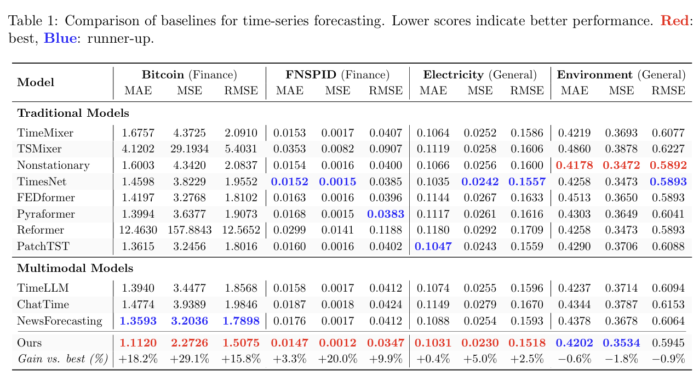

# TESS: Temporal Evolution Semantic Space

<div align="center">

[](https://arxiv.org/abs/2603.12664)
[](https://icml.cc/)

**From Text to Forecasts: Bridging Modality Gap with Temporal Evolution Semantic Space**

*ICML 2026 Oral*

</div>


## Overview

This is an offical implementation of From Text to Forecasts: Bridging Modality Gap with Temporal Evolution Semantic Space

https://arxiv.org/abs/2603.12664


## Key Designs

:star2: **Temporal Evolution Semantic Space** — TESS acts as a mediator for information exchange between textual descriptions and numerical time series. It requires two core properties: evolution-relevant (directly tied to future temporal dynamics) and quantifiable (grounded as numerical forecasting conditions).

<div align="center">
  
</div>

:star2: **Text Space → TESS** — A frozen LLM reads text and numerical observations together, and extracts temporal evolution primitives in TESS. Confidence-aware gating suppresses unreliable primitive labels.

<div align="center">
  
</div>

:star2: **TESS → Forecast** — Gated primitives condition a PatchTST-based forecaster. The model fuses compact semantic labels with historical patches, and outputs a numerical forecast grounded in temporal dynamics.

<div align="center">
  
</div>


## Main Results

MSE comparison:

<div align="center">
  
</div>

- Financial datasets: substantial gains under pronounced event-driven non-stationarity.
- General datasets: best on Electricity and runner-up on Environment, showing stable predictive capability.
- Overall: up to 29.1% MSE reduction over the strongest baseline.

## Installation

```bash
conda create -n tess python=3.10 -y && conda activate tess
pip install torch --index-url https://download.pytorch.org/whl/cu118  # adjust for your CUDA
pip install -r requirements.txt
```

## Primitive Inference

Primitive labels must be generated before training. **Inference results for all four datasets are already provided** in `data_cache/` — you can skip straight to training.

To reproduce the inference pipeline from scratch, TESS uses **Qwen3-8B** via an OpenAI-compatible API. Fill in your own API key and endpoint, then run:

```bash
BASE_URL=<your-api-endpoint> \
API_KEY=<your-api-key> \
MODEL=qwen3-8b \
bash scripts/run_other_datasets_sampling4.sh
```

## Training & Main Results

The main paper results use teacher-student distillation:

**Step 1** — Train the teacher (GT primitives, oracle upper bound):

```bash
ROOT=. MODE=gt_scale1 bash scripts/run_legacy_multimodal_primitive_additive_fnspid.sh
```

**Step 2** — Train students via distillation:

```bash
# Hard distillation
ROOT=. bash scripts/run_additive_hard_distill_fnspid.sh

# Soft distillation (probability-weighted embeddings)
ROOT=. bash scripts/run_additive_soft_distill_fnspid_v2.sh
```

| Variant | Student Model                               | Difference                                                |
| ------- | ------------------------------------------- | --------------------------------------------------------- |
| Hard    | `legacy_multimodal_primitive_additive`      | Hard ID embedding lookup                                  |
| Soft    | `legacy_multimodal_primitive_additive_soft` | Probability-weighted embedding (captures LLM uncertainty) |

Both initialize the student's numeric backbone from the teacher and distill only the primitive delta (`λ_delta=0.1`, `λ_pred=0.0`).

**View results:**

```bash
python -m experiments.summarize_additive_results --out-root outputs/tess_basic/fnspid_legacy_standard
```

## Citation

```bibtex
@inproceedings{
li2026from,
title={From Text to Forecasts: Bridging Modality Gap with Temporal Evolution Semantic Space},
author={Lehui Li and Yuyao Wang and Jisheng Yan and Wei Zhang and Jinliang Deng and Haoliang Sun and Zhongyi Han and Yongshun Gong},
booktitle={Forty-third International Conference on Machine Learning},
year={2026},
url={https://openreview.net/forum?id=S2Fd1GEyv6}
}
```
